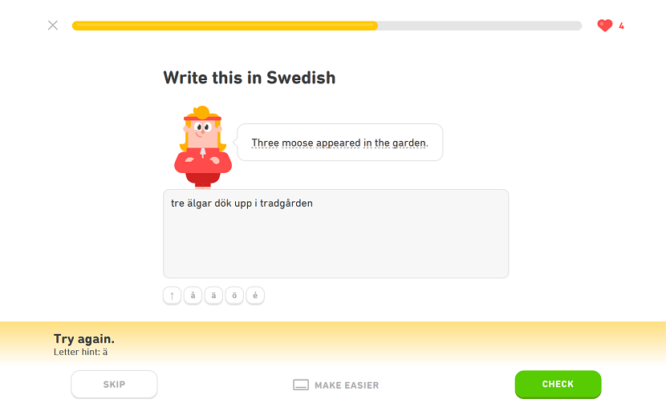

# Duolingo Mistake Catcher

A proof of concept firefox browser extension.

Normally Duolingo accepts answers containing typos and missing accents. Incorrect word forms often also get falsely flagged as a typo. This extension gives users a chance to identify errors in their answers themselves before submitting.

